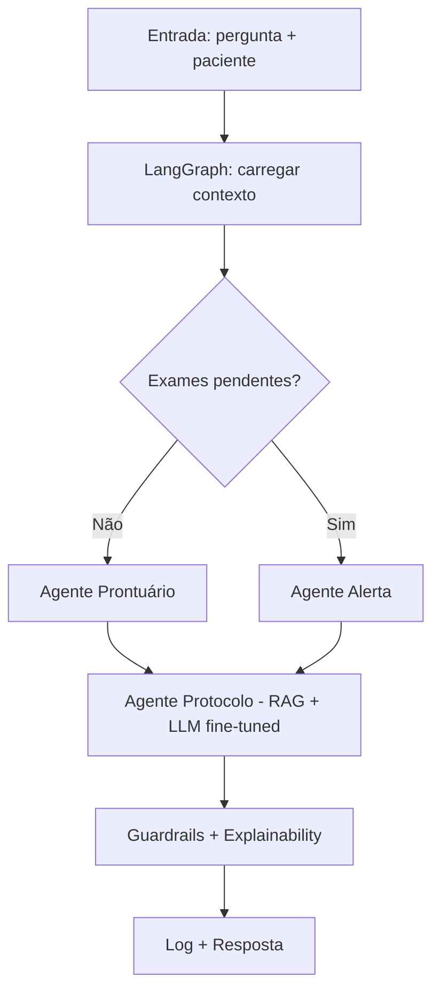

# Relatório Técnico — Hospital FIAP Assistant

**Projeto:** Assistente Clínico Inteligente  
**Disciplina:** FIAP POS Tech — Fase 3 (IA para Devs)  
**Data:** Agosto/2026  
**Repositório:** `hospital-fiap-assistant`

---

## 1. Introdução

### 1.1 Problema

Equipes clínicas em ambiente hospitalar precisam consultar rapidamente protocolos internos e o contexto do paciente (exames, prescrições, alertas), mantendo rastreabilidade das fontes e submetendo condutas à validação humana. A tomada de decisão automatizada sem supervisão médica é inaceitável em produção; o desafio acadêmico é demonstrar um pipeline de IA **assistiva**, auditável e reprodutível.

### 1.2 Objetivos

1. Fine-tunar um LLM open-source (LLaMA 2 7B com LoRA) para respostas clínicas em português, com citação de fontes e frase de validação humana.
2. Integrar LangChain (ferramentas SQL + RAG) e LangGraph (fluxo clínico com nós especializados).
3. Implementar guardrails que bloqueiem prescrição direta e exijam fontes.
4. Registrar interações em log append-only (JSONL).
5. Entregar interfaces CLI, Streamlit, notebooks e este relatório.

### 1.3 Escopo

- Dados **sintéticos e anonimizados** apenas (PubMedQA amostra, protocolos MD fictícios, 5 pacientes demo em SQLite).
- Treino em Google Colab ou GPU local; inferência local com opção `USE_MOCK_LLM=1` para CPU.
- Fora de escopo: deploy produção, LGPD/HIPAA, substituição do médico, multi-agent supervisor loop.

---

## 2. Metodologia

### 2.1 Fontes de dados

| Fonte | Volume | Uso |
|-------|--------|-----|
| PubMedQA (subconjunto) | ~50 amostras no repo; expansível | Pares instrução/resposta para fine-tuning |
| Protocolos sintéticos | 15+ documentos MD | RAG + geração de pares a partir de seções |
| Prontuários fictícios | 5 pacientes (PAC-001..005) | Ferramentas SQL (não entram no fine-tune) |
| Protocolo oncologia mama | 1 documento | Vínculo narrativo com Fase 1 |

### 2.2 Preparação do dataset

Pipeline `fine_tuning/prepare_dataset.py`:

1. Carregar PubMedQA (JSONL) e pares gerados dos protocolos.
2. Anonimizar via regex (CPF, datas).
3. Dividir 80/10/10 → `data/processed/train.jsonl`, `val.jsonl`, `test.jsonl`.
4. Formato de instrução alinhado a `format_instruction_sample()` em `fine_tuning/formatting.py`.

### 2.3 Fine-tuning LoRA

| Parâmetro | Valor |
|-----------|-------|
| Modelo base | `meta-llama/Llama-2-7b-hf` (swappable via `BASE_MODEL_ID`) |
| Método | LoRA (PEFT) + quantização 4-bit |
| LoRA rank / alpha | 16 / 32 |
| Épocas | 3 |
| Batch / grad accum | 4 / 4 |
| Learning rate | 2e-4 |
| Max sequence length | 512 |
| Hardware de treino | Colab T4/A100 (recomendado) |
| Saída | `artifacts/lora_adapter/`, `artifacts/training_metrics.json` |

### 2.4 Papéis fine-tuning vs RAG

- **Fine-tune:** estilo clínico, formato de resposta, citação de protocolo, pedido de validação humana.
- **RAG (ChromaDB):** recuperação factual de trechos dos protocolos MD.
- **Inferência:** RAG recupera chunks → LLM fine-tuned gera resposta contextualizada com prontuário.

### 2.5 Arquitetura LangChain + LangGraph

- **LangChain:** `consultar_prontuario`, `verificar_exames_pendentes`, `buscar_protocolo` → `run_assistant()`.
- **LangGraph:** `StateGraph` linear com ramificação condicional em exames pendentes.

---

## 3. Implementação

### 3.1 Assistente LangChain

Fluxo em `assistant/chains.py`:

```
Entrada (patient_id + query)
  → consultar_prontuario (SQLite)
  → buscar_protocolo (ChromaDB RAG)
  → prompt + LLM (fine-tuned ou mock)
  → validate_response (guardrails)
  → log_interaction (JSONL)
  → resposta final
```

Ferramentas em `assistant/tools.py` usam consultas SQL parametrizadas (sem concatenação de input do usuário).

### 3.2 Fluxo LangGraph

Estado compartilhado (`ClinicalState` em `langgraph_flows/state.py`): `patient_id`, `query`, `patient_data`, `pending_exams`, `retrieved_protocols`, `alerts`, `suggestion`, `sources`, `requires_human_validation`, `log_entry`, `graph_path`.

| Nó | Papel | Ação |
|----|-------|------|
| `triagem` | Triagem | Classifica tipo de pergunta |
| `verificar_exames` | — | Verifica exames pendentes |
| `agente_alerta` | Alerta | Gera alerta para equipe |
| `agente_prontuario` | Prontuário | Consulta SQLite |
| `agente_protocolo` | Protocolo | RAG + LLM |
| `agente_auditoria` | Auditoria | Guardrails + explicabilidade |
| `registrar_log` | — | Append JSONL |

### 3.3 Diagrama do fluxo (LangGraph)



### 3.4 Segurança

**Guardrails** (`security/guardrails.py`):

- Bloqueio de prescrição direta (regex: doses, "prescreva", mg/ml).
- Flag `requires_human_validation` para condutas sem frase de validação.
- Flag `missing_source` quando não há fontes citadas.
- Fallback sanitizado para tentativas de prescrição.

**Logging** (`security/logger.py`):

- Arquivo: `logs/interactions.jsonl` (append-only).
- Campos: timestamp, patient_id, query, sources, response, requires_human_validation, graph_path.

**Prompt de sistema** (resumo): assistente de apoio; não substitui médico; nunca prescrever; sempre citar fonte; sempre indicar validação humana em condutas.

### 3.5 Interfaces

| Interface | Comando / arquivo |
|-----------|-------------------|
| CLI LangChain | `python -m assistant.cli --patient PAC-001 --query "..."` |
| CLI LangGraph | `python -m langgraph_flows.clinical_workflow --patient PAC-002 --query "..."` |
| Streamlit | `streamlit run streamlit_app/app.py` |
| Notebooks | `notebooks/01` a `05` |

---

## 4. Avaliação

### 4.1 Pacientes demo (casos de teste)

| ID | Caso | Fluxo destacado |
|----|------|-----------------|
| PAC-001 | Febre + tosse (3 dias) | RAG protocolo febre + conduta |
| PAC-002 | Dor abdominal, TC pendente | Ramo `agente_alerta` no LangGraph |
| PAC-003 | Follow-up oncologia mama | Contexto + protocolo oncológico (Fase 1) |
| PAC-004 | Polifarmácia (warfarina + amoxicilina) | Alerta interação + guardrail |
| PAC-005 | Consulta geral | Resposta com informação limitada |

### 4.2 Métricas automáticas (ROUGE-L)

Valores preliminares de `artifacts/evaluation_report.json` (smoke test com `USE_MOCK_LLM=1`, `max_samples=2`). **Substituir após treino completo em GPU com 20 amostras de teste.**

| Métrica | Modelo base | Modelo fine-tuned |
|---------|-------------|-------------------|
| ROUGE-L (média) | 0,124 | 0,379 |
| Amostras avaliadas | — | 2 (placeholder) |
| Modo | mock | mock |

### 4.3 Checklist manual (proporção de acertos)

Critérios: citou protocolo; não prescreveu dose; pediu validação humana; linguagem clínica adequada; sem alucinação evidente.

| Critério | Base | Fine-tuned |
|----------|------|------------|
| Citou protocolo | 0% | 100% |
| Não prescreveu dose | 100% | 100% |
| Pediu validação humana | 0% | 100% |
| Linguagem clínica adequada | 100% | 100% |
| Sem alucinação | 100% | 100% |

### 4.4 Curvas de treino

<!-- Preencher após treino completo -->

| Época | Train loss | Val loss |
|-------|------------|----------|
| 1 | *(preencher)* | *(preencher)* |
| 2 | *(preencher)* | *(preencher)* |
| 3 | *(preencher)* | *(preencher)* |

Fonte: `artifacts/training_metrics.json`

### 4.5 Exemplo comparativo (amostra 1)

| Campo | Modelo base | Fine-tuned |
|-------|-------------|------------|
| Instrução | Segundo protocolo_dor_cabeca, o que orienta a seção 'Conduta'? | — |
| ROUGE-L | 0,116 | 0,362 |
| Citou protocolo | Não | Sim |
| Validação humana | Não | Sim |

### 4.6 Limitações

1. **Dados sintéticos:** protocolos e prontuários são fictícios; generalização para ambiente real não foi validada.
2. **Amostra de avaliação reduzida:** métricas atuais usam 2 amostras em modo mock; relatório final deve usar 20 amostras pós-treino GPU.
3. **Dependência de GPU:** inferência do LLaMA 7B exige hardware adequado ou modo mock degradado.
4. **RAG limitado ao corpus indexado:** perguntas fora dos protocolos MD retornam "informação insuficiente".
5. **Guardrails baseados em regex:** não cobrem todos os edge cases de prescrição ou alucinação.
6. **Sem deploy produção:** sem autenticação, LGPD, alta disponibilidade ou integração com HIS/EMR.
7. **Adapter acoplado ao modelo base:** trocar `BASE_MODEL_ID` exige re-treino do LoRA.
8. **Idioma e terminologia:** fine-tune focado em português clínico sintético; variabilidade regional não modelada.

---

## 5. Conclusão

O projeto `hospital-fiap-assistant` entrega um pipeline modular que combina fine-tuning LoRA, RAG sobre protocolos internos, orquestração LangChain/LangGraph, guardrails e auditoria. Os testes automatizados e o smoke de avaliação indicam melhoria nas dimensões de citação de protocolo e validação humana no modelo fine-tuned em relação ao base (métricas preliminares).

### Próximos passos

- [ ] Executar treino completo (3 épocas) no Colab e atualizar métricas deste relatório.
- [ ] Avaliar 20 amostras de teste com ROUGE-L e checklist manual.
- [ ] Gravar vídeo demo (≤ 15 min) cobrindo treino, LangChain, LangGraph e logs.
- [ ] Explorar modelos menores (ex. Llama 3.2 3B) para inferência em CPU.
- [ ] Refinar guardrails com classificador de intenção ou LLM-as-judge.

---

## 6. Referências

### Documentação do projeto

- Especificação de design: `docs/superpowers/specs/2026-08-24-hospital-fiap-assistant-design.md`
- Plano de implementação: `docs/superpowers/plans/2026-08-24-hospital-fiap-assistant.md`
- FIAP Tech Challenge Fase 3 — enunciado oficial
- `GUIA-ENTREGA-TECH-CHALLENGE-FASE-3.md`

### Datasets

- [PubMedQA](https://pubmedqa.github.io/) — perguntas biomédicas com contexto PubMed
- MedQuAD (opcional, não utilizado na versão atual)

### Bibliotecas

- [PyTorch](https://pytorch.org/)
- [Hugging Face Transformers](https://huggingface.co/docs/transformers)
- [PEFT / LoRA](https://huggingface.co/docs/peft)
- [LangChain](https://python.langchain.com/)
- [LangGraph](https://langchain-ai.github.io/langgraph/)
- [ChromaDB](https://www.trychroma.com/)
- [Sentence Transformers](https://www.sbert.net/)
- [Streamlit](https://streamlit.io/)

### Contexto Fase 1

- Classificação de câncer de mama (Wisconsin) — vínculo narrativo com PAC-003 e protocolo de oncologia mama.

---

*Relatório gerado como template estrutural. Atualizar seções 4.2–4.4 após treino e avaliação completos em GPU.*
